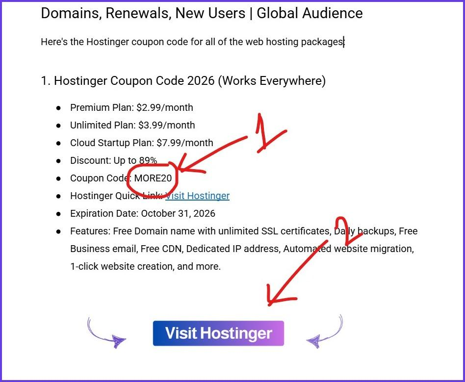
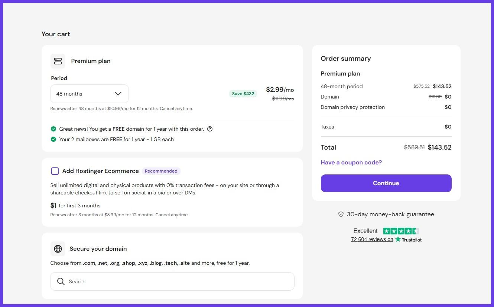
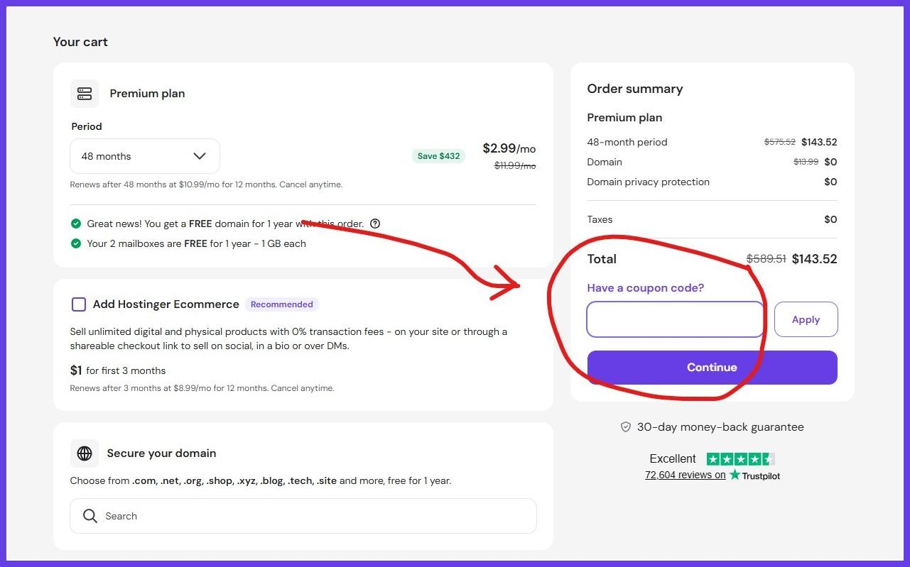
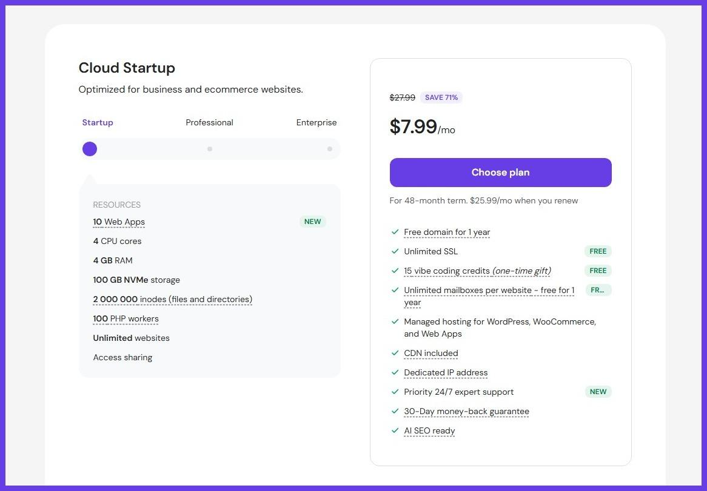
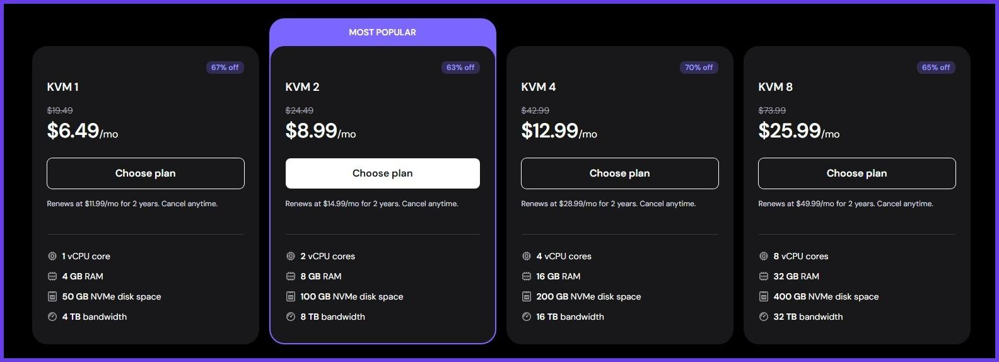
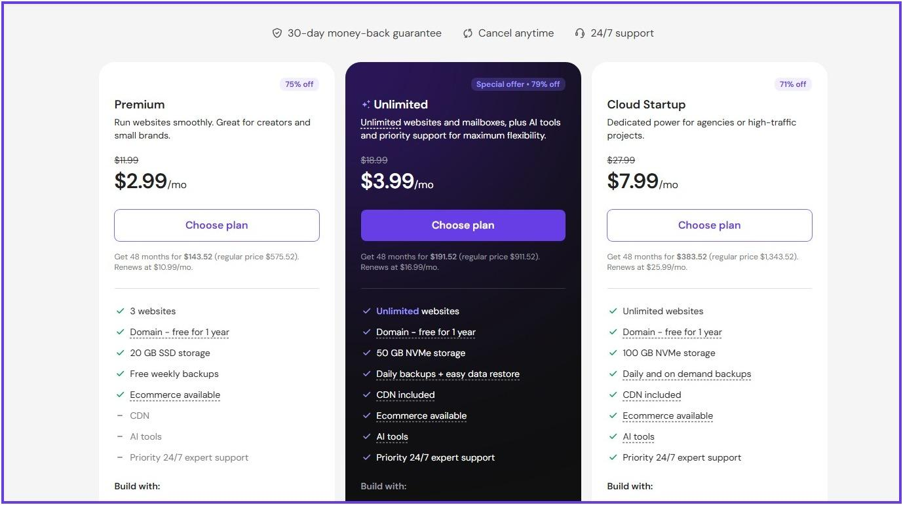
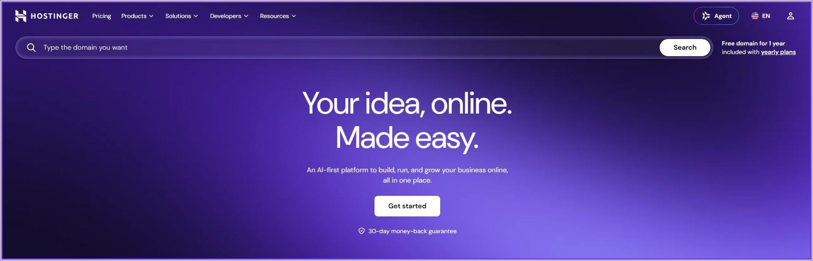

# Hostinger Coupon Code & Promo (89% OFF) October 2026

Latest Hostinger coupon codes, promo offers, discounts, and hosting deals for October 2026.

**Last Update:** 30 September 2026

Welcome to CouponForHost’s official best Hostinger Coupon Code article! I'm Eftekharul (Founder of CouponForHost) & finally collaborated officially with Hostinger.

Any guest? Finally, you can save up to 89% at the Hostinger checkout through our official coupon code. First, I want to clear one thing, you might see a lot of titles in Google searches like 91% OFF, 90% OFF, 100% OFF, blah! Blah! Blah!

All of those titles and discounts are fake & clickbait. Hostinger allows its customers to get up to an 89% discount by using a hostinger coupon code. You'll get this discount through our official Hostinger promo code article.

Our official Hostinger coupon code is **"COUPONFORHOST."** By using this coupon code, you can save the most. And the best part is you can use this coupon code on pretty much every web hosting plan, such as web, WordPress, VPS, Cloud, dedicated, and much more.

> **Note:** You may know that Hostinger offers country-based services, but you don't need to worry about anything. All of the mentioned coupon codes on this list work globally.

Without wasting your valuable time, Let's get started:

---

## Active Hostinger Coupon Code (October 2026) [Hosting, Domains, Renewals, New Users | Global Audience]

Here's the Hostinger coupon code for all of the web hosting packages:

### 1. Hostinger Coupon Code 2026 (Works Everywhere)

- **Premium Plan:** $2.99/month
- **Unlimited Plan:** $3.99/month
- **Cloud Startup Plan:** $7.99/month
- **Discount:** Up to 89%
- **Coupon Code:** [MORE20](https://couponforhost.com/hostinger)
- **Hostinger Quick Link:** [Visit Hostinger](https://couponforhost.com/hostinger)
- **Expiration Date:** October 31, 2026
- **Features:** Free Domain name with unlimited SSL certificates, Daily backups, Free Business email, Free CDN, Dedicated IP address, Automated website migration, 1-click website creation, and more.

### 2. Hostinger India Coupon Code (Works on Hostinger.in)

- **Single Plan:** ₹69/month
- **Premium Plan:** ₹149/month
- **Business Plan:** ₹249/month
- **Cloud Startup:** ₹599/month
- **Discount:** Up to 81%
- **Coupon Code:** [MORE20](https://couponforhost.com/hostinger)
- **Hostinger Quick Link:** [Visit Hostinger](https://couponforhost.com/hostinger-india)
- **Expiration Date:** October 31, 2026
- **Features:** Free Domain name with unlimited SSL certificates, Daily backups, Free Business email, Free CDN, Dedicated IP address, Automated website migration, 1-click website creation, and more.

### 3. Hostinger Pakistan Coupon Code

- **Single Plan:** Rs. 399/month
- **Premium Plan:** Rs. 599/month
- **Unlimited Plan:** Rs. 749/month
- **Cloud Startup:** Rs. 2099/month
- **Discount:** Up to 81%
- **Coupon Code:** [MORE20](https://couponforhost.com/hostinger)
- **Hostinger Quick Link:** [Visit Hostinger](https://couponforhost.com/hostinger-pk)
- **Expiration Date:** October 31, 2026
- **Features:** Free Domain name with unlimited SSL certificates, Daily backups, Free Business email, Free CDN, Dedicated IP address, Automated website migration, 1-click website creation, and more.

### 4. Hostinger Web Hosting Coupon Code

- **Premium Plan:** $2.99/month
- **Business Plan:** $3.99/month
- **Cloud Startup Plan:** $7.99/month
- **Discount:** Up to 89%
- **Coupon Code:** [MORE20](https://couponforhost.com/hostinger)
- **Hostinger Quick Link:** [Visit Hostinger](https://couponforhost.com/hostinger)
- **Expiration Date:** October 31, 2026
- **Features:** Free Domain name with unlimited SSL certificates, Daily backups, Free Business email, Free CDN, Dedicated IP address, Automated website migration, 1-click website creation, and more.

### 5. 89% OFF Hostinger Web Hosting Coupon

- **Business Plan:** $3.99/month
- **Discount:** Up to 89%
- **Coupon Code:** [MORE20](https://couponforhost.com/hostinger)
- **Hostinger Quick Link:** [Visit Hostinger](https://couponforhost.com/hostinger)
- **Expiration Date:** October 31, 2026
- **Features:** Free Domain name with unlimited SSL certificates, Daily backups, Free Business email, Free CDN, Unlimited bandwidth, AI website builder.

### 6. Hostinger Cloud Hosting Coupon (Up to 71% OFF)

- **Cloud Startup:** $7.99/month
- **Cloud Professional:** $15.99/month
- **Cloud Enterprise:** $29.99/month
- **Discount:** Up to 81%
- **Coupon Code:** [MORE20](https://couponforhost.com/hostinger)
- **Hostinger Quick Link:** [Visit Hostinger](https://couponforhost.com/hostinger)
- **Expiration Date:** October 31, 2026
- **Features:** Free Domain name with unlimited SSL certificates, Daily backups, 200 PHP workers, 6GB of RAM, 4 Core CPU, and more.

### 6. Hostinger VPS Hosting Coupon Code (77% Solid OFF)

- **KVM 1:** $6.49/month
- **KVM 2:** $8.99/month
- **KVM 4:** $12.99/month
- **KVM 8:** $25.99/month
- **Discount:** Up to 77%
- **Coupon Code:** [MORE20](https://couponforhost.com/hostinger)
- **Hostinger Quick Link:** [Visit Hostinger](https://couponforhost.com/hostinger)
- **Expiration Date:** October 31, 2026
- **Features:** Free Domain name with unlimited SSL certificates, Daily backups, 8 vCPU cores, 32 GB of RAM, 400 GB of NVMe SSD storage, 32 TB bandwidth, and more.

### 7. Hostinger WordPress Hosting Promo Code

- **Premium Plan:** $2.99/month
- **Unlimited Plan:** $3.99/month
- **Cloud Startup:** $7.99/month
- **Discount:** Up to 85%
- **Coupon Code:** [MORE20](https://couponforhost.com/hostinger)
- **Hostinger Quick Link:** [Visit Hostinger](https://couponforhost.com/hostinger)
- **Expiration Date:** October 31, 2026
- **Features:** Free Domain name with unlimited SSL certificates, Daily backups, Free Business email, Free CDN, Dedicated IP address, Automated website migration, 1-click website creation, and more.

### 8. Hostinger Website Builder Coupon

- **Premium:** $2.99/month
- **Unlimited:** $3.99/month
- **Cloud Startup:** $7.99/month
- **Discount:** Up to 85%
- **Coupon Code:** [MORE20](https://couponforhost.com/hostinger)
- **Hostinger Quick Link:** [Visit Hostinger](https://couponforhost.com/hostinger)
- **Expiration Date:** October 31, 2026
- **Features:** Free Domain name with unlimited SSL certificates, Daily backups, Free Business email, Free CDN, Dedicated IP address, Automated website migration, 1-click website creation, 150 Templates, drag-and-drop editor, mobile editing, AI website builder, and more.

### 9. Hostinger Free Domain Coupon

- **Premium:** $2.99/month
- **Business:** $3.99/month
- **Cloud Startup:** $7.99/month
- **Discount:** Up to 90%
- **Coupon Code:** [MORE20](https://couponforhost.com/hostinger)
- **Hostinger Quick Link:** [Visit Hostinger](https://couponforhost.com/hostinger)
- **Expiration Date:** October 31, 2026
- **Features:** Free Domain name with unlimited SSL certificates, Daily backups, Free Business email, Free CDN, Dedicated IP address, Automated website migration, 1-click website creation, and more.

### 10. Hostinger WooCommerce Hosting Coupon

- **Unlimited Plan:** $3.99/month
- **Cloud Startup Plan:** $7.99/month
- **Discount:** Up to 89%
- **Coupon Code:** [MORE20](https://couponforhost.com/hostinger)
- **Hostinger Quick Link:** [Visit Hostinger](https://couponforhost.com/hostinger)
- **Expiration Date:** October 31, 2026
- **Features:** Free Domain name with unlimited SSL certificates, Daily backups, 1-click WooCommerce setup, Multiple payment solutions, Free rebuild template, Free automatic store migration, and more.

### 11. Hostinger Palworld Server Coupon Code

- **Game Panel 2:** $9.49/month
- **Game Panel 4:** $13.99/month
- **Game Panel 8:** $27.99/month
- **Discount:** Up to 80%
- **Coupon Code:** [MORE20](https://couponforhost.com/hostinger)
- **Hostinger Quick Link:** [Visit Hostinger](https://couponforhost.com/hostinger)
- **Expiration Date:** October 31, 2026
- **Features:** 32GB of RAM, 8vCPU, Mod support, Full root access, DDoS protection, Automatic off-site backup, and more.

### 12. Hostinger Email Hosting Coupon

- **Starter:** $0.39/month
- **Standard:** $0.99/month
- **Premium:** $1.99/month
- **Discount:** Up to 90%
- **Coupon Code:** [MORE20](https://couponforhost.com/hostinger)
- **Hostinger Quick Link:** [Visit Hostinger](https://couponforhost.com/hostinger)
- **Expiration Date:** October 31, 2026
- **Features:** 50 GB of storage, 50 forwarding rules, 50 email aliases, antivirus checks, advanced anti-spam, free domain, and more.

### 13. Hostinger Domain Coupon Code

- **Discount:** Up to 45%
- **Coupon Code:** [BPDOMAIN](https://couponforhost.com/hostinger)
- **Hostinger Quick Link:** [Visit Hostinger](https://couponforhost.com/hostinger)
- **Expiration Date:** October 31, 2026

### 13. Hostinger Domain Renewal Coupon Code

- **Discount:** Up to 45%
- **Coupon Code:** [BPDOMAIN](https://couponforhost.com/hostinger)
- **Hostinger Quick Link:** [Visit Hostinger](https://couponforhost.com/hostinger)
- **Expiration Date:** October 31, 2026

---

## How Do You Use Hostinger Coupon Code?

If you want to use the Hostinger coupon code but don't know how, then this quick article is for you.

First, you need to come to this page and find the Hostinger coupon code in the screenshot. Then copy the Hostinger coupon code and visit the Hostinger website by clicking on the Visit Hostinger button.

When you click on the "Visit Hostinger" button, you'll be redirected to the Hostinger home page. After being redirected to Hostinger.com, you have to click on the Get Started button.

Now choose the right web hosting plan that is suitable for you. If you're just starting, then you can go with the Premium plan, but if you have a large website or e-commerce store, then you’ll go with the Cloud Startup plan.

Then you'll come to the Hostinger Cart page. Now click on the "Have a coupon code?" text as in the screenshot.

Now you can see that the coupon paste box will appear. Paste your coupon code and get up to 91% off at checkout on Hostinger.

---

## Breakdown of Hostinger Pricing and Plan

Let's break down the Hostinger plan and give a quick overview of what the plan offers you and what the plan costs:

### 1. Web Hosting

- **Price Plan:** Hostinger web hosting plans start at $2.99/month and go up to $7.99/month for the Cloud Startup plan.
- **Targeted Customer:** If anyone is just starting their online journey, then Hostinger's basic web hosting plan is perfect for them.
- **Features:** Up to 100 websites, 100GB of NVMe SSD storage, Free Domain Name With Unlimited SSL certificates, Email, daily backups, free CDN, and much more.

### 2. WordPress Hosting

- **Price Plan:** Hostinger WordPress hosting plan starts at the same price as basic web hosting, which is $2.99/month, and goes up to $7.99/month for the Cloud Startup plan.
- **Targeted Customer:** If you want to create your dream WordPress website with the most popular WordPress CMS, then Hostinger WordPress hosting is the right option for you.
- **Features:** Up to 100 websites, 100GB of NVMe SSD storage, Free Domain Name With Unlimited SSL certificates, Email Daily Backups, Free CDN, and much more.

### 3. Cloud Hosting

- **Price Plan:** Hostinger, one of the most powerful web hosting plans for Cloud startups, starts at $7.99/month and goes up to $29.99/month for the Cloud Enterprise plan.
- **Targeted Customer:** If you want more power, more server resources, and more control over your website, then Hostinger cloud hosting is the perfect fit for you.
- **Features:** Up to 300 websites, 300GB of NVMe SSD storage, 12 GB of RAM with a 6 Core CPU, Free Domain Name with Unlimited SSL certificates, Free Email, Daily Backups, Free CDN, and much more.

### 4. VPS Hosting

- **Price Plan:** Hostinger's most powerful VPS hosting plan starts at $4.99/month and goes up to $19.99/month for their KVM8 plan.
- **Targeted Customer:** VPS hosting provides full control over your server. So, if you are someone who needs more control over your website, then go with Hostinger VPS hosting.
- **Features:** 8 vCPU cores, 32 GB of RAM, 400 GB of NVMe disk space, 32 GB of bandwidth, Data center worldwide, Linux operating systems.

### 5. Hostinger AI Website Builder

- **Price Plan:** Hostinger AI website builder has two pricing plans, one for $2.99/month and one for $7.99/month
- **Targeted Customer:** If anyone wants to start their website with AI, then Hostinger AI website builder is the right option for them.
- **Features:** Up to 50 websites, Drag&Drop editor, Mobile Editing, Free domain name with SSL certificates, AI writer, AI blog generator, AI heatmaps, AI SEO tools, 100+ payment methods.

---

## Hostinger Short Review

Hostinger is one of the most powerful web hosting providers all over the world, well known for providing affordable web hosting solutions.

They provide everything you need to start your successful website, such as a free domain name with unlimited SSL certificates, free email, daily backups, free CDN, unlimited bandwidth, 1-click WordPress installation, and many more features.

Hostinger has one of the best side control panels called Hostinger hPanel. It is the best and easiest-to-use control panel that I've ever seen.

Another great feature of Hostinger is that their customer support team is very active and responsive to help you with any issues that may arise.

Overall, I would highly recommend checking out Hostinger for your web hosting needs, and don't forget to use the Hostinger coupon code for a special discount.

## Why Should You Choose Hostinger?

There are hundreds of reasons why you should choose Hostinger as your favourite web hosting provider:

- **Affordable web hosting:** One of the main reasons to use Hostinger is its affordable price. They provide the best services at affordable prices.
- **Features:** Hostinger provides all the essential features that you need to build a successful website, such as a free domain name, SSL certificates, daily backups, and more.
- **Control panel:** Their control panel is very easy to use and beginner-friendly. You can easily manage your website, domain name, email account, and database with just a few clicks.
- **Security:** Hostinger takes security very seriously. They provide free SSL certificates for all plans and daily backups of your website to keep it safe from any potential threats.
- **Customer support:** Their customer support team is available 24/7 to help you with any issues you may face while using their services.

## Terms & Conditions of Using Hostinger Promo Code

Here are a few rules that you need to follow if you want to use the Hostinger Coupon Code:

- You must be a new user to use the Hostinger coupon code.
- You can't use multiple coupon codes at the same time.
- You can't create duplicate Hostinger accounts to get a discount on Hostinger.
- None of the Hostinger coupon codes will work automatically, so you need to do it manually.
- When you purchase any web hosting services from Hostinger, their 30-day money-back guarantee will be added to it.
- If you need any additional help from us, then you can contact us via the [Couponforhost.com live chat](http://couponforhost.com/).

## Advantages & Disadvantages of Hostinger

There are no web hosting providers all over the world with no disadvantages. And when we need to talk about a company's best side, then we need to mention all of the downsides for the company.

So, here are a few pros and cons of the most popular Hostinger web hosting providers:

### Advantages of using Hostinger:

- Affordable web hosting solution
- Free domain name with unlimited SSL certificates
- certificates
- Super-fast NVMe SSD storage
- Free automatic website migration
- 1-Click WordPress installation
- Daily backup with on-demand backup
- 330-day money-backguarantee with 24/7 customer support

### Disadvantages of using Hostinger:

- Sometimes you may experience slow-loading issues with your web hosting services
- Priority support is not available with the lowest plan.

## FAQ About Hostinger Discount Code

Here are some of the most asked questions about Hostinger:

### What is Hostinger?

Hostinger is one of the most popular web hosting companies, well known for providing affordable web hosting solutions.

### Does Hostinger offer coupon codes?

Yes! Hostinger offers coupon codes, which can save up to 88% at checkout.

### What is the maximum discount I can get through your Hostinger coupon code?

By using the Hostinger coupon code, you can save up to 88% at checkout.

### What should I do if the Hostinger coupon code doesn't work for me?

All the coupon codes on this list are 100% verified. We test all of the coupon codes regularly, so you don't need to worry about the expiry date.

### How to get the maximum savings on Hostinger plans?

Using our Hostinger coupon code, you can save up to 88% on your total hosting bill.

### What is the expiry date of the Hostinger coupon code?

There's no specific date for the Hostinger coupon code expiry. But the commission percentage can go up and down at any time, so try to use it as soon as you can.

### Is the Hostinger Black Friday coupon live?

No! The Black Friday deal is only available in November.

### Can I upgrade my Hostinger plan?

Yes, you can easily upgrade your Hostinger plan from your Hostinger hPanel.

---

## More Details on Hostinger Discount Code:

- [Hostinger Coupon Code — View the better version of this](https://couponforhost.com/hostinger-coupon-code)

## More Web Hosting Coupons & Offers:

- [Namecheap Promo Code](https://couponforhost.com/namecheap-promo-code/)
- [Cloudways Promo Code](https://couponforhost.com/cloudways-promo-code/)
- [Liquid Web Coupon Code](https://couponforhost.com/liquid-web-coupon-code/)
- [Knownhost Coupon Code](https://couponforhost.com/knownhost-coupon-code/)
- [Name.com Promo Code](https://couponforhost.com/name-com-promo-code/)
